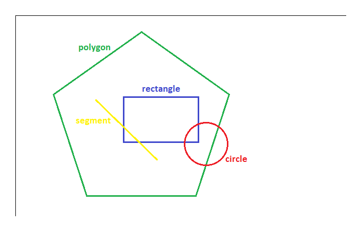

Shapes-Interaction-Library
==========================

A lightweight library of basic geometry shapes interactions.
Enables a possibility of shape intersection determination or situation when shape contains other shape.

Installation
------------

node :
```sh
$ npm install shapes-interaction
```
web :
```
<script src="unpkg.com/shapes-interaction@1.0.1/webIndex.js"></script>
```

API
---

This module exports two functions:

The `intersection` function takes two shapes as an input and returns
'true' if shapes intersect or 'false' if shapes do not intersect

```intersection(shape1, shape2)```

The `contain` function takes two shapes as an input and returns
'true' if first shape contains second shape or 'false' if first shape does not contain second shape

```contain(shape1, shape2)```

Functions maintain 5 types of shapes such as:

```point == [x, y]```
    (array of two coordinates of point)

```segment == [point, point] == [[x1, y1], [x2, y2]]```
    (array of two points)

```rectangle == [[point], width, height] == [[x, y], width, height]```
    (array of vertex, width and height of rectangle)

```circle == [[point], radius] == [[x, y], radius]```
    (array of centre and radius of circle)

```polygon == [[point1], [point2], ..., [pointN]] == [[x1, y1], [x2, y2], ..., [xN, yN]]```
    (array of N points)

Usage example
-------------



```javascript
    const shapesInteraction = require('shapes-interaction');

    const segment = [[160, 160], [280, 280]];
    const circle = [[375, 250], 40];
    const rectangle = [[210, 160], 150, 90];
    const polygon = [[75, 155], [245, 35], [420, 155], [355, 350], [140, 350]];

    shapesInteraction.intersection(segment, rectangle);  // true
    shapesInteraction.intersection(circle, segment);     // false
    shapesInteraction.intersection(rectangle, circle);   // true
    shapesInteraction.intersection(polygon, circle);     // true
    shapesInteraction.intersection(rectangle, polygon);  // false
    shapesInteraction.intersection(polygon, segment);    // false

    shapesInteraction.contain(polygon, rectangle);       // true
    shapesInteraction.contain(polygon, segment);         // true
    shapesInteraction.contain(polygon, circle);          // false
    shapesInteraction.contain(rectangle, segment);       // false
```